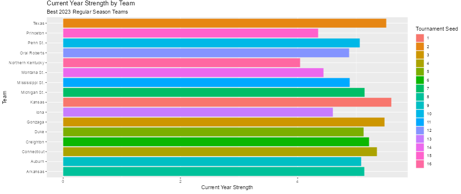
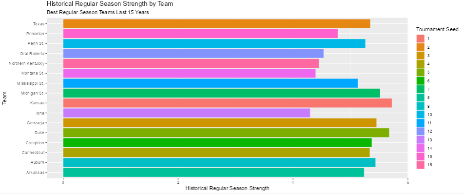
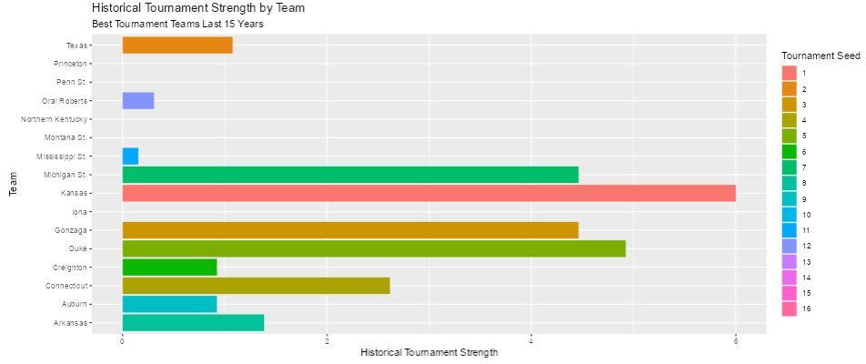
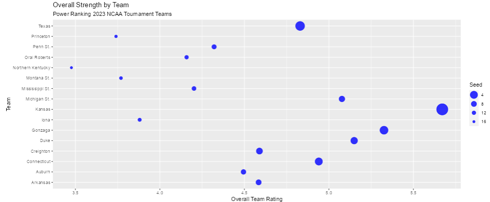

# March Madness :basketball:

Interactive shiny app in which the user can select as many teams as possible and view their rating change over the seasons from 2016 until 2023: https://linamaatouk.shinyapps.io/MarchMadnessRatings-LinaMatouk/

We used the data provided by the company 538: https://www.kaggle.com/datasets/raddar/ncaa-men-538-team-ratings

Luke shiny app url:
https://lukecowan.shinyapps.io/March_Madness_Power_Metric/

## Introduction
- This document will provide a data dictionary, describe the data cleaning and preparation process, provide analysis through visualizations, and cover the shiny apps and model that were created for the 2023 NCAA Men's March Madness Basketball Tournament.
---
## Data Dictionary :orange_book:
The variables that we used and/or created include:
- KENPOM.ADJUSTED.OFFENSE/OffenseKP - An estimate of the offensive efficiency (points scored per 100 possessions) a team would have against the average Division I defense
- Offensive_Rating - A statistic we created based on OffenseKP that measures a team's offensive ability out of 1
- KENPOM.ADJUSTED.DEFENSE/DefenseKP - An estimate of the defensive efficiency (points allowed per 100 possessions) a team would have against the average Division I offense
- Defensive_Rating - A statistic we created based on DefenseKP that measures a team's defensive ability out of 1
- BARTHAG/Barthag - An estimate of what a team's chance of winning would be against the average Division I team
- National_Rank - A statistic we created based on Barthag that assigns teams a value proportionate to their expected chances of winning out of 1
- ELITE.SOS/SOS - The difficulty or ease of a team's opponent as compared to other teams
- Strength_of_Schedule - A statistic we created based on SOS that measures the overall difficulty of a team's regular season opponents out of 1
- EFG.. - A measurement of how successful your team is from the field. This metric provides a more complete picture of the game situation than standard field goal percentages because three point shots are given extra weight.
- Effective_Field_Goal_Percent - A statistic we created based on EFG.. that measures a team's overall shooting ability out of 1
- WIN.. - The fraction of games a team has won. 
- Win_Percentage - A statistic we created based on WIN.. that measures a team's regular season winning percentage out of 1
- Current_Year_Strength - The cumulative total of the six statistics above that we created which measures how good a team was during the 2022-2023 regular season
- Tournament_Appearances - The number of times that a team has qualified for the March Madness tournament in the last fifteen years
- Historical_Strength - The cumulative total of the same six statistics from before which measures how good a team was on average during the regular seasons of the years that they made the March Madness tournament in the last fifteen years
- Historical_Tournament_Strength - A cumulative statistic measuring how well a team has performed in the March Madness tournament in the last fifteen years
- Overall_Team_Rating - A weighted average statistic that measures how good a team is based on previous and current regular season performances as well as previous torunament performances
---
## Data Cleaning :broom:
1. Selected the columns we deemed necessary or useful for analysis and changed the variable names for easier referencing
```
cleanGameData <- GameData %>%
  select(SEED, TEAM, KENPOM.ADJUSTED.DEFENSE, KENPOM.ADJUSTED.OFFENSE, ELITE.SOS, EFG.., WIN.., BARTHAG) %>%
  rename(Seed = SEED, Team = TEAM, DefenseKP = KENPOM.ADJUSTED.DEFENSE, OffenseKP = KENPOM.ADJUSTED.OFFENSE, SOS = ELITE.SOS, Barthag = BARTHAG)
```
 
2. Removed teams that are not in the 2023 NCAA March Madness Tournament and filtered for only distinct team and year values in tournament_game_data dataset
```
team_history_data <- tournament_game_data %>%
  dplyr::filter(TEAM %in%  c("Alabama", "Houston", "Kansas", "Purdue", "Arizona", "Marquette", "Texas", "UCLA",
                             "Baylor", "Gonzaga", "Kansas St.", "Xavier", "Connecticut", "Indiana", "Tennessee",
                             "Virginia", "Duke", "Miami FL", "Saint Mary's", "San Diego St.", "Creighton",
                             "Iowa St.", "Kentucky", "TCU", "Michigan St.", "Missouri", "Northwestern",
                             "Texas A&M", "Arkansas", "Iowa", "Maryland", "Memphis", "Auburn", "Florida Atlantic",
                             "Illinois", "West Virginia", "Boise St.", "Penn St.", "USC", "Utah St.",
                             "Arizona St.", "Mississippi St.", "Nevada", "North Carolina St.", "Pittsburgh",
                             "Providence", "College of Charleston", "Drake", "Oral Roberts", "VCU", "Furman",
                             "Iona", "Kent St.", "Louisiana Lafayette", "Grand Canyon", "Kennesaw St.",
                             "Montana St.", "UC Santa Barbara", "Colgate", "Princeton", "UNC Asheville", "Vermont",
                             "Fairleigh Dickinson", "Howard", "Northern Kentucky", "Southeast Missouri St.",
                             "Texas A&M Corpus Chris", "Texas Southern")) %>%
  head(n=361) 
```
---

## Data Preparation :hammer:
1. Created pivot tables (grouped by team) for the six distinct stats involved in the Historical_Strength metric
```
offense <-  team_history_data %>%
  group_by(TEAM) %>%
  summarise(Overall_Offense = sum(KENPOM.ADJUSTED.OFFENSE)) %>%
  cbind(tournament_appearances$Tournament_Appearances) %>%
  dplyr::rename("Tournament_Appearances" = "tournament_appearances$Tournament_Appearances") %>%
  mutate(Avg_Offense = Overall_Offense/Tournament_Appearances) %>%
  mutate(Offensive_Rating = Avg_Offense/120.36154)
```
- Code for the other five variables is the same apart from variable names 

2. Joined the pivot table values into the same data frame and reverted the variable names to their orginal state 
```
historical_season_strength <- team_history_data %>%
  group_by(TEAM) %>%
  summarise(Tournament_Appearances = n()) %>%
  cbind(offense$Offensive_Rating, 
        defense$Defensive_Rating, 
        barthag$National_Rank,
        strength_of_schedule$Strength_of_Schedule,
        field_goal_percent$Effective_Field_Goal_Percent,
        win_percentage$Win_Percentage) %>%
  dplyr::rename("Offensive_Rating" = "offense$Offensive_Rating",
                "Defensive_Rating" = "defense$Defensive_Rating",
                "National_Rank" = "barthag$National_Rank",
                "Strength_of_Schedule" = "strength_of_schedule$Strength_of_Schedule",
                "Effective_Field_Goal_Percent" = "field_goal_percent$Effective_Field_Goal_Percent",
                "Win_Percentage" = "win_percentage$Win_Percentage") %>%
```
3. Created a data table to assign point values to how far a team made it in the tournament
```
TEAM.ROUND <- c(64, 32, 16, 8, 4, 2, 1)

rating <- c(0, 1, 2, 3, 4, 5, 6)

round_scoring <- data.table(TEAM.ROUND, rating) 
```

4. Joined the data table to enable calculation of Historcial_Tournament_Strength
```
tournament_performance <- team_history_data %>%
  group_by(TEAM, TEAM.ROUND) %>%
  summarise(Tournament_Appearances = n()) %>%
  left_join(round_scoring, by = c("TEAM.ROUND")) 
```
5. Merged three newly created metrics into the same dataframe to enable dynamic visualization creation in shiny apps
```
top_performers_2023 <- top_performers_2023[historical_season_strength, Historical_Strength:= i.Historical_Strength,on =.(Team = TEAM)]

top_performers_2023 <- top_performers_2023[tournament_performance, Historical_Tournament_Strength:= i.Historical_Tournament_Strength,on =.(Team = TEAM)] %>%
  replace(is.na(.), 0)

top_performers_2023 <- top_performers_2023[power_ranking_metric, Overall_Team_Rating:= i.Overall_Team_Rating,on =.(Team = Team)]
```
---

# Data Analysis :mag:
1. Which team was the best during the 2022-2023 regular season?
- We calculated how good each team was on the basis of the six statistics we deemed most important and combined them into our first power ranking metric, Current_Year_Strength
```
mutate(Offensive_Rating = OffenseKP/124.0870,
         Defensive_Rating = 87.3259/DefenseKP,
         National_Rank = Barthag/.959,
         Strength_of_Schedule = SOS/38.469,
         Effective_Field_Goal_Percent = EFG../58.6,
         Win_Percentage = WIN../91.17647,
         Current_Year_Strength = Offensive_Rating + Defensive_Rating + National_Rank + Strength_of_Schedule + Effective_Field_Goal_Percent + Win_Percentage)
```
- The numerical values shown in the functions were the highest values that occurred for each stat. 
- Using ggplot, we made the following visualization:

 <br>
- While the graph may show that Kansas has the highest current year strength, Alabama ranks number one overall with a rating of 5.63. 
- This would make them the best choice based solely on this metric, but that will not be the case later on. 
- While the team seeds and strength values are relatively correspondent in this image, meaning that a higher seed  has a higher strength score, there are certainly exceptions. 
- For example, tenth seed Utah State ranks eleven positions above fourth seed Virginia on this scale. 
- All 6 sixteen seeds rank at the very bottom; while the correspondence between this metric and team seeds are not one-to-one, they are generally quite similar as indicated in the image.

2. Which teams have performed the best during the regular season in the last 15 years?
- After merging the six statistics calculated for the 2008-2022 regular seasons (see step 2 in the data preparation section), we generated our second power ranking metric, Historical_Strength
```
mutate(Historical_Strength = Offensive_Rating + Defensive_Rating + National_Rank + Strength_of_Schedule + Effective_Field_Goal_Percent + Win_Percentage)
```
- As with the previous visualization, we represented this information in a bar graph using ggplot:

 <br>
- As shown in the graph, Kansas and Duke are the two highest ranking teams with distinct values of 5.72 and 5.67.
- Six teams had no values for this variable becuase they had never qualified for the tournament before this year. Their NA values were left unchanged for this variable, so no data will be shown for those teams.
- This graph is much more volatile in terms of team seeds versus the metric value since their seed for this current year is presumably almost enirely based on the 2022-2023 regular season.
- The current year tournament seeds and the historical strength values have minimal correlation; Number one seeds Alabama and Houston rank near the midlle of the pack by this metric. 
- While this metric by itself is the least useful in predicting this year's winner, we can gain insight by comparing these results to those of the next metric, Historical_Tournament_Strength, to see if there is a strong correlation between regular season and tournament performance.

3. Which teams have performed the best in the last 15 NCAA March Madness tournaments?
- After assigning scoring values to all seven distinct rounds in the tournament bracket, we generated our third power ranking metric, Historical_Tournament_Strength.
```
tournament_performance <- team_history_data %>%

  mutate(True_Score = Tournament_Appearances * rating) %>%
  summarise(Total_Score = sum(True_Score)) %>%
  mutate(Historical_Tournament_Strength = Total_Score/6.5)
```
- The 6.5 value was used to assign a rating of six out of six to the best performing team.

 <br>
- As indicated in the chart, Kansas and Duke are once again the highest ranking teams according to this metric with respective values of 6 and 4.92. 
- Approximately one-third of the 68 teams were assigned a 0 value, either because they have never advanced beyond the first round or they have never previously qualified for the tournament.
- The four teams with the highest historcial regular season strength values from the previous visualization (Michigan State, Kansas, Duke, and Gonzaga) are also the four highest ranking within this visualization. While the two metrics do not directly mirror one another, this is evidence that teams with high regular season ratings (on the basis of the six statistics we utilized) are likely to perform well in the tournament.

4. Who will be this year's winner?
- In order to predict which team would win the entire tournament we created a final power ranking metric, Overall_Team_rating, based on the previous three metrics.
```
power_ranking_metric <- top_performers_2023 %>%
  select(Seed, Team, Current_Year_Strength, Historical_Strength, Historical_Tournament_Strength) %>%
  mutate(Overall_Team_Rating = ifelse(is.na(Historical_Strength), (Current_Year_Strength * 0.85 + Historical_Tournament_Strength * 0.15),
                                      (Current_Year_Strength * 0.75 + Historical_Strength * 0.1 + Historical_Tournament_Strength * 0.15)))
```
- The 6 teams without historical regular season strength data do not have this metric factored into their overall rating. The defualt weighted average, however, consists of all three and is most dependent upon a team's performace during this year's regular season.

 <br>
- While regular season performance is typically a good indicator as to how a team will perform in the tournament, we felt that did not encapsulate the entire picture which is why we chose to include data from previous years. For example, no one would have bet on the eighth-seeded North Carolina Tar Heels, a program that has almost always been formidable in decades past, to make it to the championship game in last year's torunament solely on the basis of how well they did during the regular season. 
- This metric aims to capture some of that uncertainty and unpredictability that March Madness is known for. 
- Kansas once again ranks number one based on this metric with a value of 5.67. Gonzaga, Duke, Kentucky, and Michigan St. are the other teams with the greatest chances of winning based on our strength ratings.
- There is a high amount of variability between team seed and the results from this rating, especially near the top of the rankings; seventh seed Michigan State is ranked above second seed Texas by a sizeable margin. 
---

# Shiny Apps :gem:
- For each of the visualizations we created, we also developed shiny app interfaces which allow users to dynamically explore the datasets. 

1. The first of these is related to the four power ranking metrics covered in the data analysis section.
- The app takes 16 distinct team inputs from the user and displays the corresponding information for current year strength, historical strength, historical tournament strength, and overall strength. 
- The following code was used to make the app dynamic:
```
selectizeInput("Teams", label = "Choose 16 teams.", choices = top_performers_2023$Team, multiple = TRUE, options = list(maxItems = 16)),
actionButton("Button", "Go")
           
observeEvent(input$Button, {  
  top_performers_2023 <- top_performers_2023[Team %in% input$Teams]
``` 
- The app can be accessed with this url: https://lukecowan.shinyapps.io/March_Madness_Power_Metric/
    


